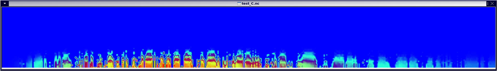

# GRTCODE
> GRTCODE is a GPU-able Radiative Transfer Code.

The application takes in molecular spectroscopic observations from idealized labratory conditions (see HITRAN, Rothman et al), a specification of an atmosphere (netcdf file), and computes the Optical Depth based on plane parallel methods/approximations.

Currently GRTCODE uses a numerically approximated Voigt profile, although code for Lorentz is included and GRTCODE permits simple use of other methods.  Users can perform this computation on traditional CPU or accelerated by a CUDA capable GPU (5x-15x speedups commonly observed).  Additionally, users can specificy features such as the line shape Wing Cutoff, output resolution, output range, a water-vapor continuum and more.  Output is a Netcdf file.  GRTCODE was often compared with Oxford's RFM as a sanity check during development.  Although many other Radiative Transfer codes such as RFM exist, GRTCODE was originally designed to be a GPU only code, and later GRTCODE design was shifted towards "Almost-Single-Source-Code" hybrid CPU or GPU application.

## Installation

### Depends

* Compatible C compiler 
    * NVCC for CUDA enabled code
* Netcdf library and header is currently required, but this dependency is expected to be removed.
    * typically a yum/apt-get install of netcdf and netcdf-dev(el) has been sufficient.  OSX should read that section.
* GNU libargp is currently required to handle to complexity of arguments, although you can easily find the source on the web and make it here.

TIP: HPC users with certain Module enviornments may be able to use a commands like `module load netcdf` for some depends, ymwv.

#### Optional

* MPI, though if you are using this I expect you don't need me to tell you that...

### Linux

Read Depends.  Then:

make

### OS X 

Read Depends.

I used macports to port install netcdf and friends to /opt/local.  Homebrew should work similarly, or you can build from sources, though your paths may vary using any of these methods.  I have included the Makefile.port I use so you can adjust it with your correct OSX paths if needed. Then:

make -f Makefile.port

## Usage

### Input HITRAN files

The application was setup to consume "database" files directly from the HITRAN molecular database.  For convenience, the files I used (from HITRAN) are stored here in a public repo:

https://gitlab.com/geebdubya/HITFILES

### Input Atmosphere

Included are some example atmos input files.

* AllForc_jan21981rad_19820103met.atmos_rfm.nc is a global atmos example file used during testing and validation with RFM.
* smallSubset_2t is a 2time x 2lat x 2lon slice of columns from the prior file.
* mls.nc is a stub for a Mid-Lattitude-Summer reference.

If you structure your input similarly to these, and with the correct units, grtcode should eat them.  You can for example, create a file with 1 time, 1 lat, and 1 lon and N levels to compute a single column.  Note that the netcdf parsing code does expect these dimensions.

### Examples

The --help menu should have adequate descriptions, but below are example calls that cover common options.  Example input atmos files should live in INPUT/ and you are free to create your own in their image.  HITRAN data file locations can be specified.  Additionally you can customize the HITRAN files by adding removing lines (record rows), which would allow you to compute shapes for single lines etc.

Computes optical depths for HITRAN molecule number 02 (CO2),  with a global concentration of 400ppmv (converted to ATM via 400/1million = 0.000400 ) from wavenumbers [500,800] on the host at a high resolution of 0.0005 wavenumber.

./grtcode.x -a MYATMOSINPUT.nc -o myco2.nc HITRANFILEPATH/02_hit12.par -20.0004 -w500 -W800 -h -r0.0005

Computes optical depths for HITRAN molecule number 03 (O3), with atmospheric concentrations specified in the MYATMOSINPUT.nc file from (default) longwave wavenumbers [1 , 3000] on the (default) device for eight time levels [0,7].

./grtcode.x -a MYATMOSINPUT.nc -o myo3.nc HITRANFILEPATH/03_hit12.par -3a -t0 -T7

Computes optical depths for HITRAN molecules 1 through 7, with H2O and O3 specified via MYATMOSINPUT.nc, the remaining gases specified globally on the command line, computed on the device with the Water Vapor Continuum Enabled. This range is specified [1,50000], but this is easily changed as shown before.

./grtcode.x -a MYATMOSINPUT.nc -o my_all.nc HITRANFILEPATH/0[1-7]*.par -1a -3a -20.000400 -40.000328 -50.0000001 -60.001834 -70.209460 -C -w1 -W50000

DANGER: An example that computes wavenumbers [1,50000]@1wavenumber resolution for 144lat x 90lon x 48 vertical layers x 8 timesteps in 4byte floats will require ~=1TB of output space.

### Less Common Features that you should be aware of:

You can specifiy a specific device by using -d N, where N is the GPUID.  This serves two purposes, first allowing you to specify a device of your choosing, and second it provides a Keep-It-Stupid-Simple multi process distribution.  That is, one can simply use netcdf tools to slice the input data into multiple smaller inputs by Time or Spatially, launch several grtcode processes on distinct devices via a shell script, wait and concatenate the results. 

Additionally, MPI was roughed in.  To use MPI you will need to use/modify the Makefile.mpi which sets a CPP define: MPI_ENABLED.  Then you can use the --mpi flag, which alters the behavior of the -d flag.  -d should now be used to specify the number of GPU devices per node.  So on a cluster/machine with K gpus per compute node, if you wanted to lease M nodes you could run N=M*K ranks, with 1 rank to 1 gpu by:

mpriun -n N ./grtcode --mpi -d K ....

One could also run on a single machine with K gpus in mpi mode via :

mpirun -n K ./grtcode --mpi -d K

I expect this to change in the future as it was a last second hack, but I'd like to see how/if this gets used before I spend any personal time on it (since I'd go the simpler non-mpi route myself!).

## Release History

* 0.0.1
    * A test

## Meta

Garrett Wright - Garrett.Wrong+GRTCODE@gmail.com

Distributed under the GNU GPLv2-only license. See included ``gpl-2.0.LICENSE`` for more information.

[https://gitlab.com/geebdubya/GRTCODE](https://gitlab.com/geebdubya/GRTCODE)

Many thanks to David Paynter at GFDL for reference papers and general steering of feature adds like netcdf and argparsing that hopefully extend this from the original beerware to something people in the atmospheric science community might be able to use and extend.  It is in this spirit that the GPLv2-only license was selected, so that improvement may always have a path to be absorbed and re-emitted in GRTCODE.....

Additional thanks to NOAA who through my affiliated employment offered to devote some resources (ie me) to specfically develop these additional scientific-user friendly features like Netcdf IO and basic MPI task sharing to the original beerware and provide several validation datasets.